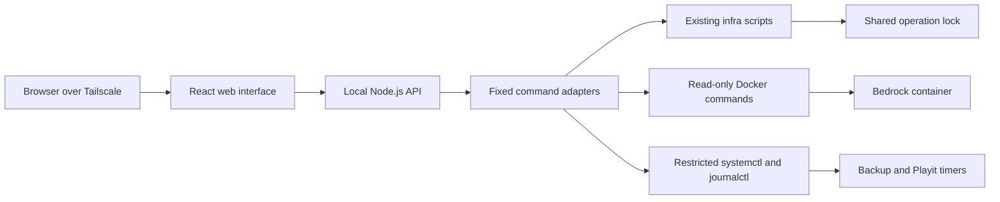

# Minecraft Server GUI Implementation Plan

## Status

This is a future implementation plan. No GUI components are currently deployed.

## Objective

Build a private web administration interface for the Minecraft Bedrock server running in Docker inside WSL2. The GUI should make routine monitoring and maintenance easier without weakening the safety guarantees already implemented by the infrastructure scripts.

The first release should answer these questions quickly:

- Is Minecraft online and accepting Bedrock UDP requests?
- How many players are online?
- Is the Playit tunnel healthy?
- When did the last valid backup complete?
- When will the next backup run?
- Is disk or memory usage approaching a limit?
- What happened in recent Minecraft, backup, and Playit logs?

Administrative actions should be introduced incrementally and require explicit confirmation where they can interrupt service or replace world data.

## Non-Goals

The initial GUI will not:

- Replace Docker Compose, systemd, or the existing infrastructure scripts.
- Expose the application directly to the public internet.
- Mount the Docker socket into an internet-facing container.
- Implement Minecraft status, backup, restore, or rollback logic independently of the existing scripts.
- Store passwords, tokens, or Playit credentials in source control.
- Offer restore, deployment, arbitrary shell execution, or configuration editing in the first release.
- Attempt to derive a live list of player names from the Bedrock UDP status protocol. The protocol provides counts, while names can only be inferred from server logs and may be incomplete.

## Guiding Principles

1. **Existing scripts remain the source of truth.** The GUI invokes narrow, documented interfaces rather than duplicating infrastructure behavior.
2. **Read-only first.** Monitoring ships before mutation.
3. **No arbitrary command endpoint.** Every server action maps to a fixed backend operation with validated inputs.
4. **One world-changing operation at a time.** Backup, restore, and deployment continue to use the shared advisory lock.
5. **Private access only.** Bind to localhost or the WSL Tailscale address and enforce authentication before adding write operations.
6. **Fail closed.** Missing dependencies, malformed output, unknown state, and timeouts are displayed as failures or unknown states rather than success.
7. **Auditable actions.** Every write operation records who requested it, when it ran, its result, and a correlation ID.
8. **Mobile and desktop usability.** The interface should work from a phone over Tailscale as well as from a desktop browser.

## Proposed Architecture



### Frontend

- React with Vite and TypeScript.
- A quiet, operational dashboard optimized for scanning rather than a marketing layout.
- Server-Sent Events for live operation progress and log tails.
- No direct access to Docker, systemd, the filesystem, or shell commands.

### Backend

- Node.js with TypeScript and Fastify.
- Runs directly inside WSL2 as a dedicated systemd service.
- Uses `child_process.spawn` with argument arrays, fixed executable paths, timeouts, output limits, and no shell interpolation.
- Reads runtime configuration from a dedicated ignored environment file such as `gui/.env`.
- Exposes only versioned routes under `/api/v1`.

### Deployment Model

The recommended first deployment runs the backend directly in WSL rather than in Docker. This avoids granting a web container control of the Docker socket and systemd.

The backend should run as a dedicated Linux user such as `mcgui`. That user receives only the minimum access required for implemented features. Write operations should use narrowly scoped root-owned wrapper services or explicit `sudoers` entries. It must never receive unrestricted passwordless `sudo`.

## Repository Layout

Proposed future structure:

```text
gui/
  api/
    src/
      adapters/
      routes/
      services/
      schemas/
      server.ts
    test/
    package.json
    tsconfig.json
  web/
    src/
      components/
      pages/
      api/
    test/
    package.json
    vite.config.ts
  systemd/
    mc-gui.service
  .env.example
  README.md
infra/
  status-json.sh
  backups-json.sh
  operation-status.sh
GUI_IMPLEMENTATION_PLAN.md
```

A monorepo workspace can be introduced under `gui/` once implementation begins. Do not add JavaScript dependencies until Phase 1 starts.

## Backend Contract Strategy

The GUI must not scrape the current human-readable dashboard. Before implementing API routes, add structured, noninteractive interfaces to the infrastructure layer.

Preferred approach:

- Add `--json` support to read-only scripts where it remains simple.
- Add dedicated JSON helper scripts when changing human-facing output would make a script harder to maintain.
- Keep JSON output on stdout and diagnostics on stderr.
- Use stable field names, explicit `null` for unknown values, ISO 8601 UTC timestamps, and machine-readable error codes.
- Preserve existing human-readable behavior when `--json` is not supplied.

Example status document:

```json
{
  "generatedAt": "2026-08-17T22:45:00Z",
  "minecraft": {
    "containerExists": true,
    "containerRunning": true,
    "responding": true,
    "version": "1.26.44",
    "playersOnline": 0,
    "playersMax": 20,
    "publishedPort": 19132
  },
  "playit": {
    "serviceActive": true,
    "tunnelHealthy": true,
    "phase": "connected"
  },
  "backup": {
    "timerActive": true,
    "nextRun": "2026-08-18T07:00:00Z",
    "latestCompletedAt": "2026-08-17T22:36:33Z",
    "latestAgeSeconds": 507,
    "completedCount": 3
  },
  "system": {
    "wslDiskUsedPercent": 1,
    "windowsDiskUsedPercent": 25,
    "memoryUsedBytes": 0
  }
}
```

## API Surface

### Phase 1 Read-Only Routes

| Method | Route | Purpose |
| --- | --- | --- |
| `GET` | `/api/v1/status` | Aggregated Minecraft, Playit, backup, timer, disk, and memory status |
| `GET` | `/api/v1/backups` | Valid completed backups and pre-restore snapshots |
| `GET` | `/api/v1/logs?source=...&limit=...` | Bounded recent logs from an allowlisted source |
| `GET` | `/api/v1/operations/current` | Current operation-lock state, if any |
| `GET` | `/api/v1/version` | GUI and infrastructure contract versions |
| `GET` | `/healthz` | Backend process health only |
| `GET` | `/readyz` | Backend dependency readiness |

Allowed log sources should initially be `minecraft`, `backup`, `playit`, and `playit-health`. Reject unknown sources and cap both line count and response size.

### Phase 2 Write Routes

| Method | Route | Purpose |
| --- | --- | --- |
| `POST` | `/api/v1/backups` | Start a manual backup |
| `POST` | `/api/v1/health-checks` | Run and capture a full infrastructure health check |
| `POST` | `/api/v1/services/playit/restart` | Restart Playit through a restricted operation |
| `POST` | `/api/v1/services/minecraft/restart` | Gracefully restart the Bedrock container |

Write routes return `202 Accepted` with an operation ID. Clients observe progress through an operation route or Server-Sent Events. The API must reject a second conflicting operation with `409 Conflict`.

### Later Destructive Routes

Restore and deployment should not be exposed until all safeguards in their phases are complete.

- `POST /api/v1/restores`
- `POST /api/v1/deployments`
- `POST /api/v1/gamerules/apply`
- Configuration changes through narrowly defined schemas

There will be no route that accepts an arbitrary command or script path.

## User Experience

### Overview

The first screen is the actual operational dashboard and includes:

- Minecraft state, version, uptime, player count, and maximum players.
- Playit service and tunnel state.
- Latest backup age and next scheduled backup.
- Disk and memory usage.
- Current operation and recent failures.
- Compact actions appropriate to the implemented phase.

Statuses must distinguish `healthy`, `degraded`, `failed`, and `unknown`. Unknown must never be rendered as healthy.

### Backups

- List valid backups with timestamp, age, size, location type, and validation state.
- Clearly distinguish normal backups from pre-restore snapshots.
- Manual backup action with progress in Phase 2.
- Restore remains unavailable until its dedicated phase.

### Logs

- Tabs for Minecraft, backup, Playit, and Playit health.
- Bounded initial history.
- Optional live follow through Server-Sent Events.
- Pause, resume, search, and download visible content.
- Escape all log content before rendering.

### Maintenance

- Health check and service restarts in Phase 2.
- Deploy and restore in later phases.
- Destructive actions display the selected target, expected interruption, backup prerequisite, and typed confirmation.

### Player Information

The dashboard can reliably show online and maximum counts through `mc-monitor`. A later best-effort activity view may parse connect/disconnect events from logs, but it must be labeled as recent activity rather than a definitive online-name list.

## Security Model

### Network Boundary

- Default bind address: `127.0.0.1`.
- Remote use should go through Tailscale, either by binding to the Tailscale address or using a Tailscale proxy feature.
- Do not forward the GUI through Playit.
- Do not expose the GUI port on the public router.
- Configure an explicit trusted-proxy list if proxy headers are used.

### Authentication

Phase 1 may initially run on localhost only. Before remote access or write routes:

- Prefer Tailscale identity headers from a trusted local proxy.
- Otherwise use a local authenticated session with a strong password hash and secure, HTTP-only cookies.
- Require CSRF protection for cookie-authenticated write requests.
- Apply request-rate limits to login and mutation routes.
- Never accept identity headers directly from arbitrary clients.

### Authorization

Plan for two roles even if the first deployment has one user:

- `viewer`: status, backup list, and bounded logs.
- `operator`: viewer permissions plus approved write operations.

Restore, deploy, and configuration changes should require the operator role plus explicit confirmation.

### Privilege Boundary

- The backend must not run as root.
- Do not grant unrestricted Docker or sudo access without documenting that it is root-equivalent.
- Prefer root-owned systemd oneshot units for privileged actions. The GUI requests an allowlisted unit and observes its status.
- If `sudoers` is used, allow only exact wrapper commands with no user-controlled command fragments.
- Validate backup identifiers against the existing timestamp format and resolve paths beneath the configured backup roots.
- Apply output-size limits and execution timeouts to every child process.

### Secrets

- Ignore `gui/.env`, session keys, and local authentication data.
- Provide `gui/.env.example` with placeholders only.
- Rotate a session secret if it is ever exposed.
- Never include the contents of environment files in API responses or logs.

## Operation Model

Each write operation should have:

- A generated operation ID.
- Type, requester identity, request time, start time, finish time, and result.
- `queued`, `running`, `succeeded`, `failed`, or `cancelled` state.
- Bounded stdout/stderr capture with secret filtering.
- A timeout appropriate to the operation.
- A clear statement of whether cancellation is safe.

Operation metadata can initially be stored as append-only JSON lines under an ignored WSL Linux filesystem path. Do not store operational state on `/mnt/c` if frequent writes become a performance concern. SQLite is appropriate once querying or concurrency warrants it.

Backup, restore, and deploy must continue to use the same `MC_OPERATION_LOCK_FILE`. The GUI's operation state is informational and must not replace the infrastructure lock.

## Phased Delivery Plan

## Phase 0: Contracts and Test Harness

**Goal:** Make existing behavior consumable without changing operations.

Tasks:

- Define JSON schemas for status, backups, errors, and operation results.
- Add structured status output using the existing `mc-monitor`, Docker, and systemd checks.
- Add a noninteractive backup-list command that validates each listed backup.
- Add bounded log-reader wrappers with an allowlist of sources.
- Add fixtures for healthy, degraded, failed, and unknown command output.
- Add ShellCheck to local validation or CI.
- Add tests that use stub executables rather than real Docker/systemd services.
- Document the contract version and compatibility policy.

Acceptance criteria:

- JSON output parses successfully and contains no human narration.
- Existing terminal commands retain their current behavior.
- Tests do not require starting Minecraft, Docker, Playit, or systemd.
- Unknown or malformed dependency output produces an explicit nonzero result or `null` field.

## Phase 1: Read-Only Local Dashboard

**Goal:** Deliver a useful dashboard with no mutation capability.

Tasks:

- Scaffold `gui/api` and `gui/web` with TypeScript.
- Implement fixed command adapters with timeouts and output limits.
- Implement status, backup-list, version, and bounded-log routes.
- Build Overview, Backups, and Logs views.
- Add loading, stale-data, empty, degraded, and failure states.
- Poll status at a conservative interval such as 15 seconds.
- Add backend health and readiness endpoints.
- Add unit, route, and component tests.
- Run as the normal WSL user on localhost during development.

Acceptance criteria:

- The dashboard correctly reflects a healthy server and each simulated failure state.
- No API route can mutate Docker, systemd, world data, or configuration.
- Status requests complete within a defined timeout.
- The interface works at common phone and desktop sizes.
- Logs are escaped and response sizes are bounded.

## Phase 2: Private Service and Safe Actions

**Goal:** Operate the dashboard privately over Tailscale and add low-risk actions.

Tasks:

- Create a dedicated `mcgui` user and systemd service.
- Configure localhost or Tailscale-only access.
- Add authentication and viewer/operator authorization.
- Implement append-only audit events.
- Add manual backup through an asynchronous operation.
- Add full health-check execution.
- Add controlled Minecraft and Playit restart operations.
- Add Server-Sent Events for operation progress and live logs.
- Add rate limiting, CSRF protection where applicable, and request IDs.
- Document installation, upgrade, rollback, and log locations.

Acceptance criteria:

- The GUI is unreachable from untrusted interfaces.
- Every write action requires an authenticated operator.
- Conflicting operations return `409` and do not bypass `flock`.
- A manual backup created through the GUI passes the same validation as a CLI backup.
- Every write action has a durable audit record.
- Backend restart does not lose the ability to determine the infrastructure lock state.

## Phase 3: Restore Workflow

**Goal:** Expose restore without weakening current rollback behavior.

Tasks:

- Add a noninteractive restore mode accepting one validated backup identifier.
- Add dry-run validation that reports target metadata without changing the world.
- Require a recent valid backup before restore unless an explicit break-glass policy is used.
- Present server interruption, selected backup, age, and pre-restore snapshot behavior.
- Require typed confirmation using the exact backup identifier.
- Stream restore stages and final readiness verification.
- Display automatic rollback outcomes distinctly from successful restore outcomes.
- Add fault-injection tests for copy failure, startup timeout, interruption, and rollback failure.

Acceptance criteria:

- The API cannot restore a path outside configured backup roots.
- Cancellation is disabled once the directory swap begins unless a proven safe mechanism exists.
- A failed readiness check restores the original world using existing infrastructure behavior.
- The UI never reports success before Bedrock responds to the UDP status probe.
- Restore tests cover every existing rollback branch.

## Phase 4: Deployment and Configuration

**Goal:** Support pinned Bedrock upgrades and narrowly scoped settings.

Tasks:

- Add deployment preflight showing current and target versions, disk space, backup health, and operation-lock state.
- Require an exact pinned Bedrock version; reject `LATEST` for production deployment.
- Invoke the existing deploy workflow asynchronously and stream its stages.
- Display whether rollback succeeded if target readiness fails.
- Add schema-driven editing only for approved configuration keys.
- Never expose raw environment-file editing in the browser.
- Add gamerule preview and apply operations after policy is finalized.

Acceptance criteria:

- Deployment cannot begin with an invalid version, unhealthy backup prerequisite, or conflicting operation.
- The UI distinguishes update success, update failure with successful rollback, and rollback failure.
- Configuration writes are atomic, validated, backed up, and audited.
- Secrets and unknown environment keys are neither returned nor overwritten.

## Phase 5: Operational Hardening

**Goal:** Make the GUI dependable enough for routine administration.

Tasks:

- Add end-to-end browser tests for desktop and mobile viewports.
- Add API integration tests with a complete fake infrastructure command layer.
- Add dependency and secret scanning.
- Add a Content Security Policy and hardened security headers.
- Add log rotation and audit retention.
- Add service resource limits and restart policy.
- Add off-machine backup status once a remote backup destination exists.
- Add an upgrade and rollback runbook for the GUI itself.
- Document recovery when the GUI is unavailable; CLI scripts must remain fully usable.

Acceptance criteria:

- The GUI can be removed or stopped without affecting Minecraft, Playit, backups, or CLI administration.
- Automated tests cover all write-operation failure modes.
- Security review finds no arbitrary command, path traversal, unauthenticated mutation, or public-listener path.
- A documented rollback returns to the previous GUI release without changing world data.

## Testing Strategy

### Unit Tests

- Environment and command-output parsers.
- JSON schema validation.
- Path and backup-identifier validation.
- Authorization decisions.
- Operation-state transitions.
- Log source and line-limit validation.

### Infrastructure Contract Tests

Provide fake `docker`, `systemctl`, `journalctl`, `playit`, `df`, and `free` executables earlier in `PATH`. Test scripts against fixtures for:

- Healthy server.
- Missing container.
- Running container with failed UDP status.
- Missing or stale backup.
- Failed backup service.
- Inactive timer.
- Playit disconnected and cooldown behavior.
- Disk threshold exceeded.
- Malformed dependency output.

No contract test should touch the real server.

### API Tests

- Route schemas and status codes.
- Child-process timeout and output truncation.
- Authentication and role enforcement.
- Concurrent operation rejection.
- Audit record creation.
- Redaction of sensitive values.

### Frontend Tests

- Healthy, degraded, failed, unknown, loading, and stale states.
- Responsive layouts at phone and desktop sizes.
- Confirmation dialogs for write operations.
- Accessible keyboard navigation and labels.
- Safe rendering of hostile log text.

### End-to-End Tests

Run against the fake API by default. A separate manual validation checklist may run against the homelab during a maintenance window. Automated CI must never target the production server.

## Observability

The GUI should expose its own health separately from Minecraft health.

Track:

- API request duration and failures.
- Command-adapter duration, timeout, and exit status.
- Last successful status refresh.
- Active and recent operations.
- Authentication failures and rejected authorization attempts.
- Backend process restarts.

Do not log environment-file contents, session cookies, credentials, or complete sensitive command lines.

## Rollout Strategy

1. Develop and test with fake command fixtures on a non-server machine.
2. Install Phase 1 on the homelab bound to `127.0.0.1` only.
3. Compare GUI status with the existing dashboard and healthcheck commands.
4. Observe read-only behavior for several days.
5. Add Tailscale-only access and authentication.
6. Enable one Phase 2 action at a time, beginning with manual backup.
7. Keep CLI commands documented and test them after every GUI release.
8. Add restore and deployment only during planned maintenance windows after fault-injection tests pass.

Rollback for every phase is to stop and disable `mc-gui.service` and use the existing CLI scripts. The GUI must never become a dependency of Minecraft, Playit, backup timers, or restore recovery.

## Definition of Done

A phase is complete only when:

- Its acceptance criteria pass.
- Tests cover success, failure, timeout, and malformed-output behavior.
- Security-sensitive routes have authorization tests.
- Documentation includes install, operation, troubleshooting, and rollback steps.
- Existing CLI behavior remains available and validated.
- No secrets or runtime data are committed.
- The production server has been validated during an explicit maintenance or observation window appropriate to the phase.

## Open Decisions

Resolve these before Phase 2:

- Tailscale identity proxy versus application-managed login.
- Dedicated systemd action units versus narrow `sudoers` wrappers.
- JSON Lines versus SQLite for operation and audit history.
- Exact GUI bind address and trusted proxy configuration.
- Whether recent player activity inferred from logs is worth retaining.
- Off-machine backup destination and how its status should be displayed.

Resolve these before Phase 3:

- Required maximum age of the pre-restore safety backup.
- Whether restore is allowed while players are online.
- Break-glass policy when automatic preconditions fail.

Resolve these before Phase 4:

- Approved editable configuration keys.
- Gamerule policy and ownership.
- Deployment maintenance-window and notification policy.

## Recommended First Implementation Slice

The first code change should be Phase 0 only:

1. Define a versioned status JSON schema.
2. Add a structured status command backed by existing helpers.
3. Create fake Docker/systemd/Playit fixtures.
4. Test healthy and failed states without contacting the production server.

Do not scaffold the web application until that contract is stable. A reliable machine interface is the controlling dependency for every GUI feature.
